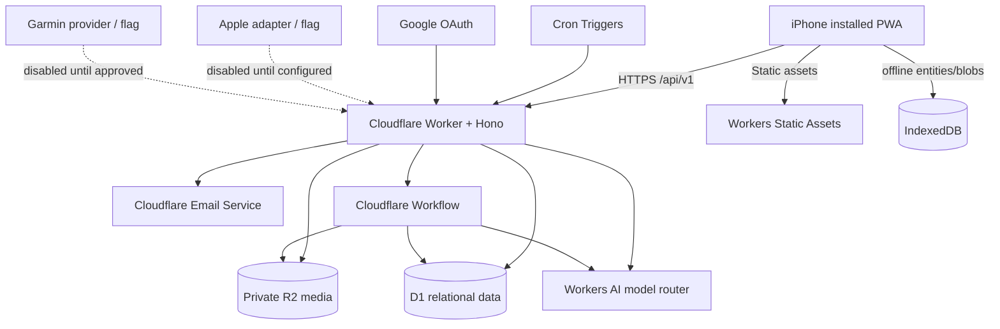
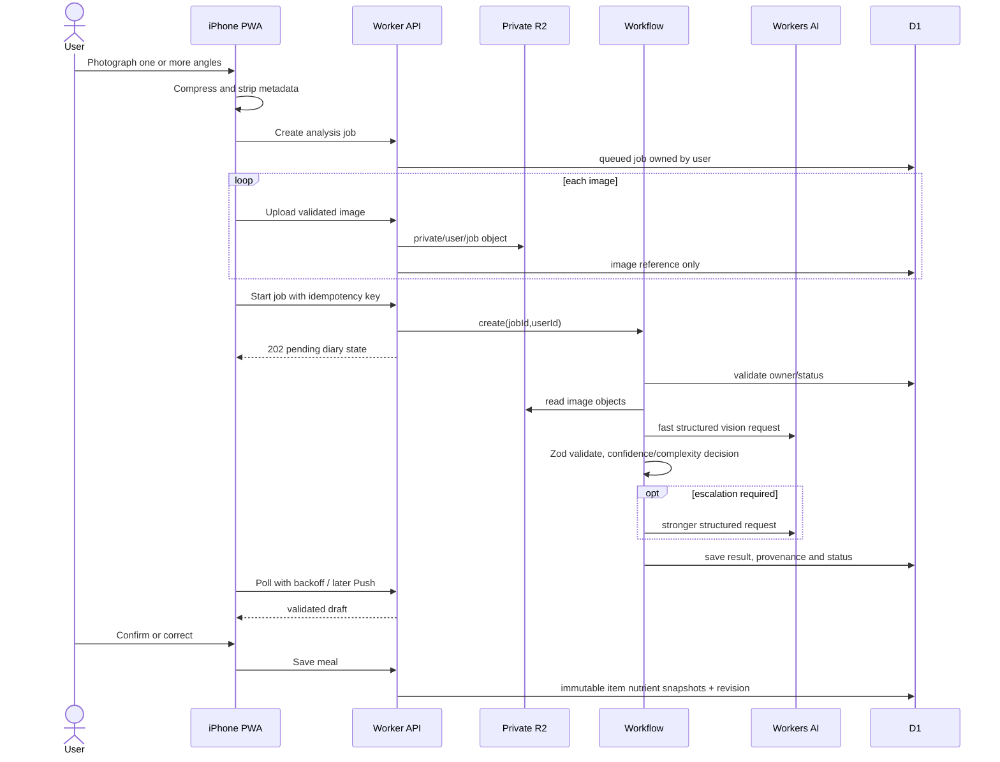
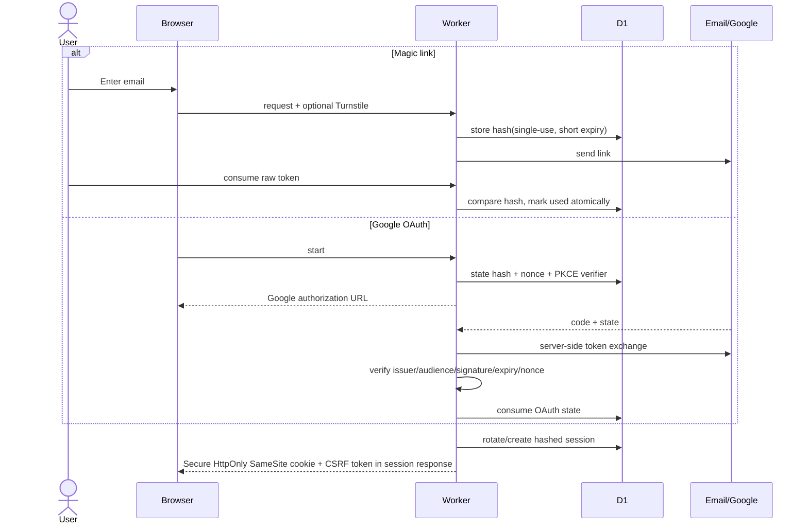
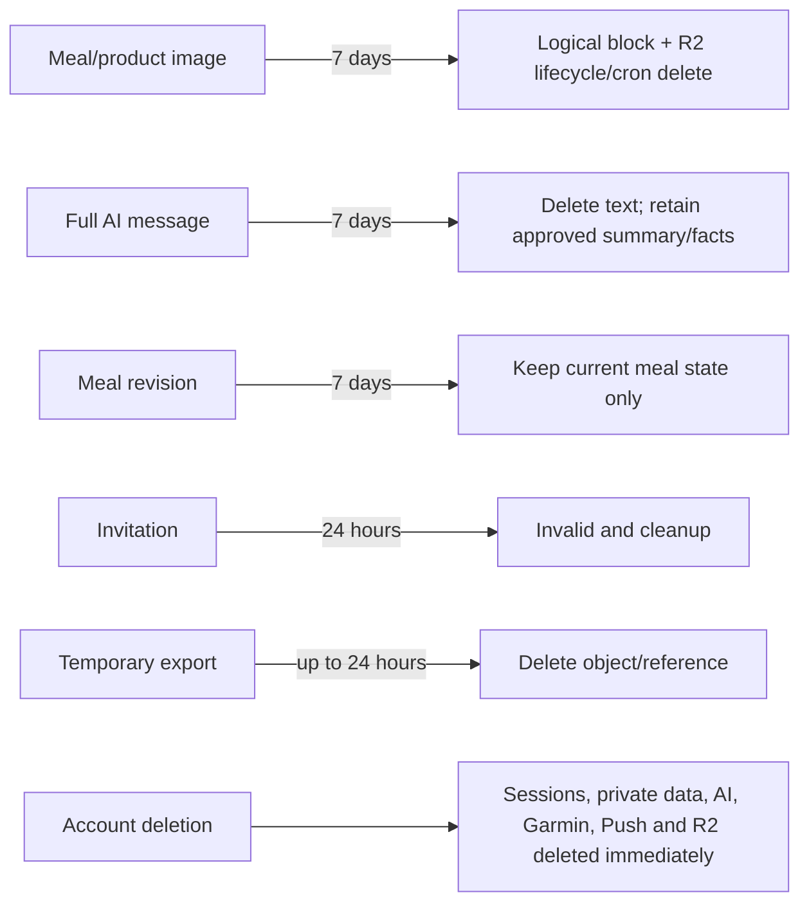
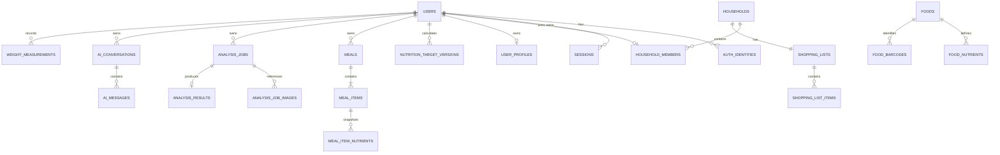

# Architecture Overview

## Style

A Cloudflare-first modular monolith keeps deployment and operations simple while preserving boundaries between HTTP transport, domain rules, repositories, AI providers, workflows and scheduled jobs. The browser never receives OAuth tokens or server session tokens.

## Component diagram

## Meal analysis sequence

## Authentication sequence

## Retention diagram

## ER diagram (core relationships)

## Authorization invariants

- Personal queries always include `owner_user_id = authenticated user`.
- Cross-user misses return 404 rather than revealing existence.
- Household membership is never substituted for personal ownership.
- Shared products preserve creator ownership; other members duplicate instead of editing canonical data.
- Shopping updates require matching household and LWW metadata.
